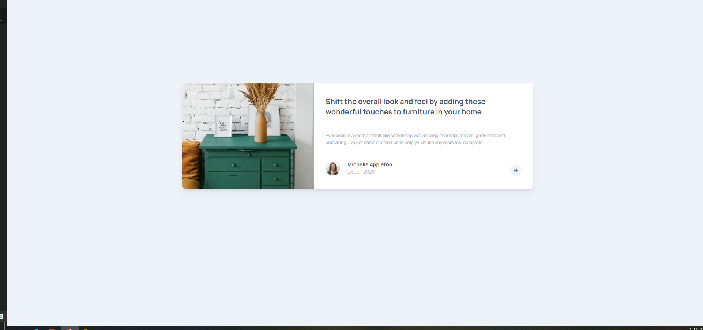

# Frontend Mentor - Article preview component solution

This is a solution to the [Article preview component challenge on Frontend Mentor](https://www.frontendmentor.io/challenges/article-preview-component-dYBN_pYFT).

## Table of contents

- [Screenshot](#screenshot)
- [Links](#links)
- [Built with](#built-with)
- [Author](#author)

### Screenshot

### Links

- Solution URL: [solution URL Github](https://github.com/MohammadSoleimanikia/article-preview-component)
- Live Site URL: [live site URL](https://mohammadsoleimanikia.github.io/article-preview-component/)

### Built with

- Semantic HTML5 markup
- CSS custom properties
- Flexbox
- Mobile-first workflow
-Java Script

## Author

- Git Hub - [Mohammad Soleimanikia](https://github.com/MohammadSoleimanikia)
- Frontend Mentor - [@MohammadSoleimanikia](https://www.frontendmentor.io/profile/MohammadSoleimanikia)
